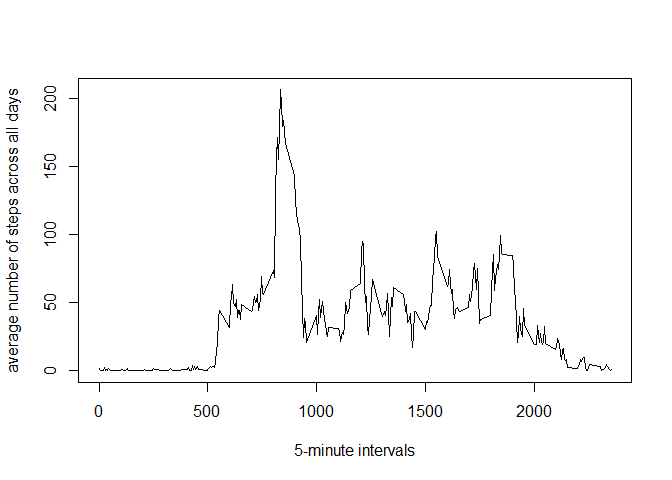

# Reproducible Research: Peer Assessment 1


## Loading and preprocessing the data

Loading the data


```r
setwd("C://COURSERA/reproducible_research")
con<-file("activity.csv")
open(con,"r")
df<-read.csv(con)
close(con)
```

Process/transform the data into a format suitable for analysis


```r
df$date<-as.Date(df$date,"%Y-%m-%d")
df$interval<-as.factor(df$interval)
```


## What is mean total number of steps taken per day?

Calculate the total number of steps taken per day


```r
library(dplyr)
```

```
## 
## Attaching package: 'dplyr'
## 
## The following object is masked from 'package:stats':
## 
##     filter
## 
## The following objects are masked from 'package:base':
## 
##     intersect, setdiff, setequal, union
```

```r
pd<-group_by(df,date)
tot_pd<-summarize(pd,tot_steps=sum(steps,na.rm=TRUE))
```

A histogram and a barplot of the total number of steps taken each day


```r
hist(tot_pd$tot_steps,main=NULL,xlab="total number of steps taken each day")
```

 

```r
barplot(tot_pd$tot_steps)
```

 

Calculate and report the mean and median of the total number of steps taken per day


```r
m=mean(tot_pd$tot_steps)
print(m)
```

```
## [1] 9354.23
```

```r
med=median(tot_pd$tot_steps)
print(med)
```

```
## [1] 10395
```


## What is the average daily activity pattern?

Make a time series plot of the 5-minute interval (x-axis) and the average number of steps taken, averaged across all days (y-axis)


```r
p5m<-group_by(df,interval)
av_p5m<-summarize(p5m,av_steps=mean(steps,na.rm=TRUE))
av_p5m$interval<-as.numeric(as.character(av_p5m$interval))
plot(av_p5m$interval,av_p5m$av_steps,type="l",xlab="5-minute intervals",ylab="average number of steps across all days")
```

 

Calculate and report the 5-minute interval, on average across all the days in the dataset, that contains the maximum number of steps


```r
maximum<-max(av_p5m$av_steps)
the_5min_interval<-av_p5m$interval[av_p5m$av_steps==maximum]
print(the_5min_interval)
```

```
## [1] 835
```


## Imputing missing values

Calculate and report the total number of missing values in the dataset


```r
number_of_NAs<-nrow(df[is.na(df$steps),])
print(number_of_NAs)
```

```
## [1] 2304
```

Devise a strategy for filling in all of the missing values in the dataset, using the mean for that 5-minute interval. Create a new dataset that is equal to the original dataset but with the missing data filled in.


```r
data<-df
for (i in 1:17568) {
    if (is.na(data$steps[i])) {
        data$steps[i]<-av_p5m$av_steps[av_p5m$interval==data$interval[i]]
    }
}
```

Make a histogram of the total number of steps taken each day and calculate and report the mean and median total number of steps taken per day.


```r
npd<-group_by(data,date)
tot_npd<-summarize(npd,tot_steps=sum(steps,na.rm=TRUE))
hist(tot_npd$tot_steps,xlab="total number of steps",main=NULL)
```

 

```r
new_m=mean(tot_npd$tot_steps)
print(new_m)
```

```
## [1] 10766.19
```

```r
new_med=median(tot_npd$tot_steps)
print(new_med)
```

```
## [1] 10766.19
```


## Are there differences in activity patterns between weekdays and weekends?

Create a new factor variable in the dataset with two levels – “weekday” and “weekend” indicating whether a given date is a weekday or weekend day.


```r
Sys.setlocale("LC_TIME", "English")
```

```
## [1] "English_United States.1252"
```

```r
data<-mutate(data,day=weekdays(data$date,abbreviate=TRUE))
dataset<-mutate(data,kind_of_day=factor(1*(day=="Sat" | day=="Sun"),labels=c("weekday","weekend")))
```

Make a panel plot containing a time series plot of the 5-minute interval and the average number of steps taken, averaged across all weekday days or weekend days.


```r
dataset$interval<-as.numeric(as.character(dataset$interval))
dataset_p5m<-group_by(dataset,kind_of_day,interval)
dataset_av_p5m<-summarize(dataset_p5m,av_steps=mean(steps))
library(ggplot2)
plot<-qplot(interval,av_steps,data=dataset_av_p5m,facets=kind_of_day~.,geom="line",colour=kind_of_day,ylab="average number of steps")
print(plot)
```

 
